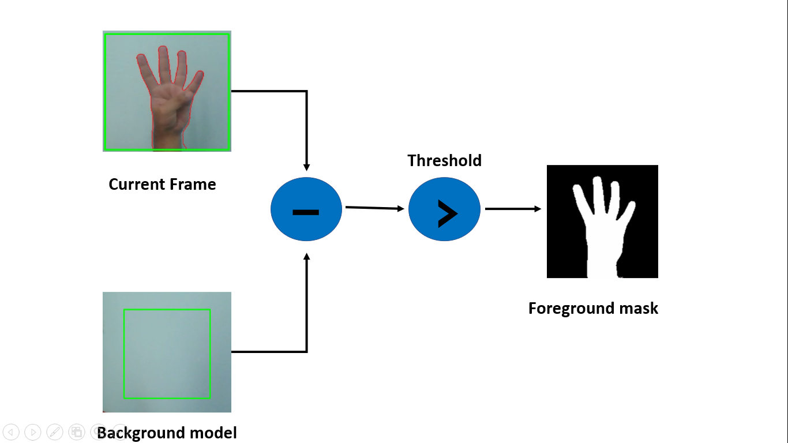
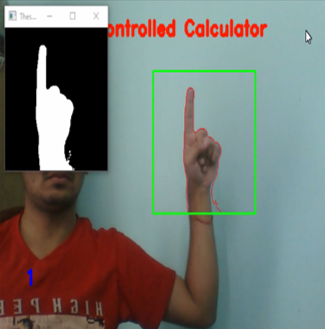
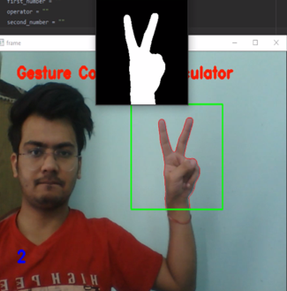
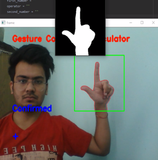
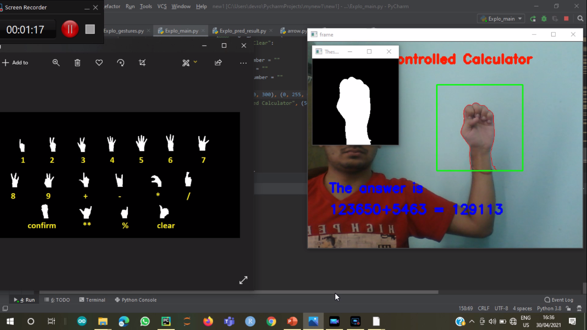

# Gesture-controlled-opencv-calculator

## Introduction
Gestures play an important role in our everyday communication and expression. Thus using them to communicate with tech devices needs very little intellectual data processing from our side. That means we can control different things such as vending machines almost without thinking, just by using our fingers and hands. Gesture recognition is a technology aimed at providing live-time data to a computer to execute commands the user wants. People do not need to type anything with keys or tap on a touch screen to perform a specific action. The device's motion sensor can perceive and interpret the person's movements as the primary source of data input
The scope of the project is to construct a synchronous gesture classifying system that can recognize gestures in lighting circumstances spontaneously. To achieve this goal, a synchronous gesture which based on real time is generated to recognize gestures. An intention of this project is to generate a complete system which can identify, spot and explain the hand motioning through computer sight. This structure will work as one of the envisioning of computer sight and AI with user interaction. It create function to identify hand motion based on various arguments. The topmost preference of the structure is to make it easy to use, simple to handle and user amiable without producing any specific hardware. All functions will appear on same Computer or workstation. Only some specific hardware will be used to digitalize the picture.

## Flow of the Project-
1 – Creating custom gestures using opencv

2 – Model Making for gesture recognition

3 – Find and segment the hand from the video sequence

4 – Gesture recognition and model prediction

5 – Feeding set of gestures as numbers and operators for performing calculator operations.

# Creating custom gestures using OpenCV
For model training, we need training set. Here, we are manually creating gestures for model training purposes. Explo_gestures.py is the python file which is being used to make gestures. Following are the samples of manually created gesture images.

## Gesture recognition and model prediction
Now, the image of the segmented hand is feeded to the model as the input. The output of the model will be a 18 dimensional vector which represents the probability for 18 classes i.e., whether the input image belongs to this class or that. Using np.argmax function, we get the index of highest probability score predicted by the model. Using the list label, we get the final results.Here are some examples - 

                  

## Feeding set of gestures as numbers and operators for performing calculator operations
Using gestures we first input First Number, Operator and the Second Number. For inputing the digits of the numbers and the operators, we kept a window of 2 secs for each.
Once the numbers and operators are inputed, the result will be printed on the screen.

After feeding the first number, operator and the second number. The result will be printed on the screen like – 

