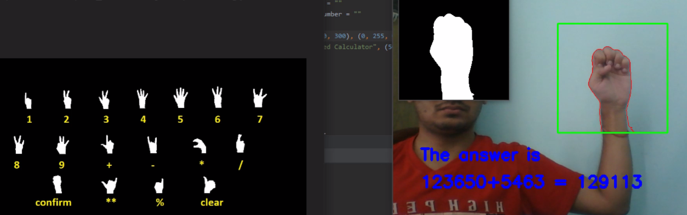

# Gesture-controlled-opencv-calculator

## Introduction
Gestures play an important role in our everyday communication and expression. Thus using them to communicate with tech devices needs very little intellectual data processing from our side. That means we can control different things such as vending machines almost without thinking, just by using our fingers and hands. Gesture recognition is a technology aimed at providing live-time data to a computer to execute commands the user wants. People do not need to type anything with keys or tap on a touch screen to perform a specific action. The device's motion sensor can perceive and interpret the person's movements as the primary source of data input
The scope of the project is to construct a synchronous gesture classifying system that can recognize gestures in lighting circumstances spontaneously. To achieve this goal, a synchronous gesture which based on real time is generated to recognize gestures. An intention of this project is to generate a complete system which can identify, spot and explain the hand motioning through computer sight. This structure will work as one of the envisioning of computer sight and AI with user interaction. It create function to identify hand motion based on various arguments. The topmost preference of the structure is to make it easy to use, simple to handle and user amiable without producing any specific hardware. All functions will appear on same Computer or workstation. Only some specific hardware will be used to digitalize the picture.

## Flow of the Project-
1 – Creating custom gestures using opencv

2 – Model Making for gesture recognition

3 – Find and segment the hand from the video sequence

4 – Gesture recognition and model prediction

5 – Feeding set of gestures as numbers and operators for performing calculator operations.

## Creating custom gestures using OpenCV
For model training, we need training set. Here, we are manually creating gestures for model training purposes. Explo_gestures.py is the python file which is being used to make gestures. Following are the samples of manually created gesture images.

                                    

## Model Making for gesture recognition
We used deep learning techniques for model building. For model training, we have 18 different classes having 800+ images for each class and we have also used data augmentation for creating batches of images. The Sequential model architecture consists of 4 convolution layers with 32, 64, 64, 128 filters respectively. Two Maxpooling layers are used, each after two convolution layers for reducing the dimension of the images followed by dropout layers. Then, a flatten layer followed by 3 Dense layers of 64, 32 ,18 units respectively. The activation function used for the last dense layer having 18 units is softmax function, which gives us the probability of those 18 classes. 

## Model performance analysis
Model is well trained since we have a lot of training data and also have used data augmentation techniques to make our model robust. This trained model has achieved an accuracy of 98.89% on training data and 98.13% on testing data in only 10 epochs. This model can handle variations in the positions of hand as well. The model takes an image of preprocessed hand gesture of shape (32,32) as the input and predicts the corresponding label for the gesture.For full code, please refer to the explo.ipynb file.

       

The labels for different gestures are as follows-

## Find and segment the hand from the video sequence
We are going to recognize the gestures from a video sequence. To recognize these gestures from a live video sequence, we first need to take out the hand region alone removing the unwanted portions in the video sequence. Hence, for segmenting the hand region, there are three major steps-

(i)	Background Subtraction

(ii)	Motion detection and thresholding 

(iii)	Contour Extraction 

## Background subtraction

To do this, we used the concept of running averages. We make our system to look over a particular scene for 30 frames. During this period, we compute the running average over the current frame and the previous frames. After figuring out the background, we bring in our hand and make the system understand that our hand is a new entry into the background, which means it becomes the foreground object.
 
After figuring out the background model using running averages, we use the current frame which holds the foreground object (hand in our case) in addition to the background. We calculate the absolute difference between the background model (updated over time) and the current frame (which has our hand) to obtain a difference image that holds the newly added foreground object (which is our hand). 

## Motion detection and thresholding
To detect the hand region from this difference image, we need to threshold the difference image, so that only our hand region becomes visible and all the other unwanted regions are painted as black.

## Contour Extraction
After thresholding the difference image, we find contours in the resulting image. The contour with the largest area is assumed to be our hand.
The results after applying the above steps - 

## Gesture recognition and model prediction
Now, the image of the segmented hand is feeded to the model as the input. The output of the model will be a 18 dimensional vector which represents the probability for 18 classes i.e., whether the input image belongs to this class or that. Using np.argmax function, we get the index of highest probability score predicted by the model. Using the list label, we get the final results.Here are some examples - 

                  

## Feeding set of gestures as numbers and operators for performing calculator operations
Using gestures we first input First Number, Operator and the Second Number. For inputing the digits of the numbers and the operators, we kept a window of 2 secs for each.
Once the numbers and operators are inputed, the result will be printed on the screen.

After feeding the first number, operator and the second number. The result will be printed on the screen like – 

